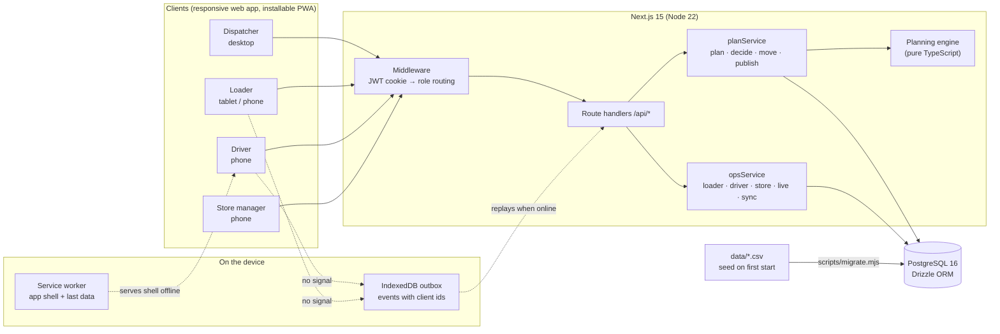

# Architecture

Waypoint Dispatch is one Next.js application (UI and API in the same process) backed by one PostgreSQL database. The planning engine is a plain TypeScript module with no I/O, so it runs in the API, in unit tests and from the command line in the same way.

## Components

| Part | Where | What it does |
|---|---|---|
| UI | `web/src/app/**` | Four role areas: `/dispatcher` (orders, plan, deferrals, live run, forecast), `/loader`, `/driver`, `/store`. Each one is responsive. The field roles are built for phones first. |
| Middleware | `web/src/middleware.ts` | Reads the signed session cookie and sends each role to its own area. API calls are checked again inside each handler. |
| API | `web/src/app/api/**` | Thin route handlers. They check the role, call a service function, and return JSON. |
| planService | `web/src/lib/planService.ts` | Loads the depot's day from the database, runs the engine, and stores the trips, stops and proposed deferrals. It also applies the dispatcher's decisions (defer, keep with a window extension, split, move) and publishes. |
| opsService | `web/src/lib/opsService.ts` | Covers what happens after publishing: loader checklists and seals, the driver's run, store ETAs and receipts, the live board, the forecast, and the `/api/sync` endpoint. |
| Engine | `web/src/lib/engine/` | `planDay()` builds the trips. `validate()` checks any trip a person edits by hand. See [planning-engine.md](planning-engine.md). |
| Offline | `web/public/sw.js`, `web/src/lib/client/outbox.ts` | The service worker caches the app shell and the last-fetched data. Driver and loader actions go into an IndexedDB outbox, each with a client-generated id. |
| Database | PostgreSQL 16 | Schema in `web/src/db/schema.ts`; migrations in `web/drizzle/`. See [data-model.md](data-model.md). |
| Seed | `web/scripts/migrate.mjs`, `web/src/lib/seed-core.mjs` | Migrates, then loads the shared CSVs plus the demo day (10 April 2026) if the database is empty. `SEED_FORCE=1`, or the **Reset demo day** button, reloads it. |

## Offline mode and recovery

1. **Read path.** When the driver or loader page loads online, it stores the run in IndexedDB (`cached()`). Without signal, the page renders from that copy and shows **Saved run**.
2. **Write path.** Every field action is an event: start trip, arrive, complete a stop (with signature, photo and GPS), load check, flag, or seal. Each event gets a UUID on the phone and goes into the outbox before anything is sent. The UI reads the outbox too, so a stop saved offline shows as done straight away and is marked **Saved on phone**.
3. **Replay.** On `online`, on page load, and every 15 seconds, the outbox posts its pending events to `/api/sync` in order.
4. **Idempotency.** `/api/sync` records each event id in `sync_events` (primary key) once the event has been handled. A second copy of an event (a retry after a dropped response, say) is acknowledged as `duplicate` without being applied again.
5. **Conflict rules.** A stop is completed only once. The first completion to reach the server wins, and a later one comes back as `duplicate`. A flag the store raises about the same item as a loader flag is matched to it automatically.
6. **Recovery report.** After a sync, the driver sees what was sent, what the server matched, and anything rejected. The dispatcher's live board shows when each trip last synced and flags trips that have been quiet for too long.
7. **Demo control.** Judges can test all of this without turning Wi-Fi off. The account menu on the driver and loader screens has a **Simulate no signal** switch. It routes every write to the outbox exactly as a real network loss would.

## Security

* Passwords are hashed with bcrypt. The session is an HS256 JWT in an `httpOnly`, `sameSite=lax` cookie, valid for 7 days.
* Each API handler checks the role (`requireRole`). With `DEMO_MODE=false`, the server also holds each account to its own data (`ownOutlet`, `ownVehicle`, `ownDepot` in `lib/auth.ts`). A store manager sees and acts for their own outlet only, a driver for their own vehicle's trips, and a loader for their own depot. Field updates for someone else's trip are rejected during sync. `DEMO_MODE` defaults to true so the "(demo)" pickers can show every case during judging.
* Secrets come from the environment (`AUTH_SECRET`, `DATABASE_URL`). See `.env.example`.

## Continuous integration

`.github/workflows/ci.yml` runs on every push and pull request: `npm ci`, the TypeScript typecheck, the unit tests (engine, independent rule checker, breakdown repair, history-fitted models) and a production build.

## Deployment

`docker compose up` builds the web image and starts Postgres. The web container runs `node scripts/migrate.mjs` (migrate, then seed) before `next start`. `render.yaml` deploys the same Docker image as a Render web service, connected to a Neon Postgres database through `DATABASE_URL`.
