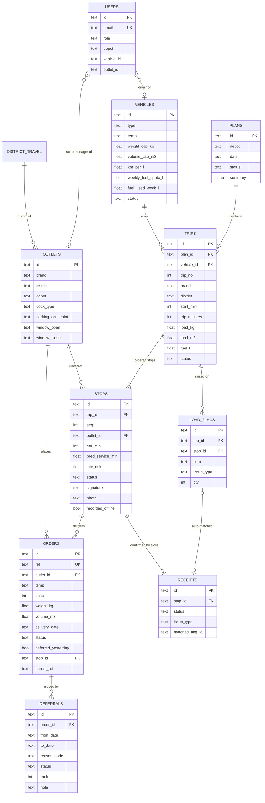

# Data model

PostgreSQL 16 through Drizzle ORM. The source of truth is `web/src/db/schema.ts`; the SQL migration is `web/drizzle/0000_init.sql`.

Reference tables are loaded from the shared datasets in `data/`. Operational tables are written by the app.

## Reference data (seeded from `data/`)

| Table | Source | Notes |
|---|---|---|
| `outlets` | `outlets.csv` | Brand, district, depot, dock type, `van_only` parking, delivery window (mall windows applied). |
| `vehicles` | `vehicles.csv` + `demo_fleet_status.csv` | Capacity by weight and volume, reefer or ambient, truck or van, km/L, weekly fuel quota, fuel used Mon–Thu (`fuel_used_week.csv`, from km actually driven the same week last year), and workshop status on the demo day. Published plans earlier in the same ISO week add their trips' fuel when a later day is planned. |
| `district_travel` | `district_travel.csv` | Depot-to-district and inter-stop distance and free-flow time. Used by the Task 2B trip-time formula. |
| `service_allowance` | `service_allowance.csv` | Handling minutes by brand × dock type. |
| `traffic_speed` | `traffic_speed.csv` | Speed index by district × hour × monsoon. Used for predicted ETAs and late risk, not for the hard budget. |
| `calendar_days` | `calendar.csv` | Operating days, holidays, festival ramps, monsoon flag, ISO week. |
| `forecast_weeks` | `forecast_weekly.csv` | Weekly total and chilled m³ per depot, derived from the order history. |

## Operational data

| Table | Written by | Purpose |
|---|---|---|
| `orders` | Seed, store app, dispatcher (phone orders, splits) | One row per order. `status` moves `confirmed → planned → delivered/partial/refused/failed`, or to `deferred`. A split creates child orders with `parent_ref`. |
| `plans` | planService | One plan per depot per date (unique). `summary` stores the engine totals shown in the plan banner. |
| `trips`, `stops` | planService, then field events | Engine output. Stops collect proof of delivery (receiver name, signature, photo, GPS, delivered units) and are marked `recorded_offline` when they came through the outbox. |
| `deferrals` | Engine (proposed), dispatcher (confirmed), store (requested) | Each deferral has a reason code (`REEFER_CAPACITY`, `VAN_CAPACITY`, `WINDOW`, `FUEL`, `FLEET_CAPACITY`, `OVERSIZE`, `MANUAL`), plain-language text and a rank, so the dispatcher sees what to accept first. |
| `load_flags` | Loader | Missing or damaged items found at the dock. Each flag notifies the store and the dispatcher. |
| `receipts` | Store manager | Confirms the delivery or reports an issue. It is matched to a loader flag automatically when the item and type agree. |
| `notifications` | Services | Feed for each audience (`DISPATCHER`, `OUTLET:<id>`, …): deferral notices, flags, late-risk alerts. |
| `sync_events` | `/api/sync` | Idempotency log: one row per client event id with its result (`applied`, `duplicate`, `rejected: …`). |
| `users` | Seed | Four demo accounts, one per role. Passwords are stored as bcrypt hashes. |
